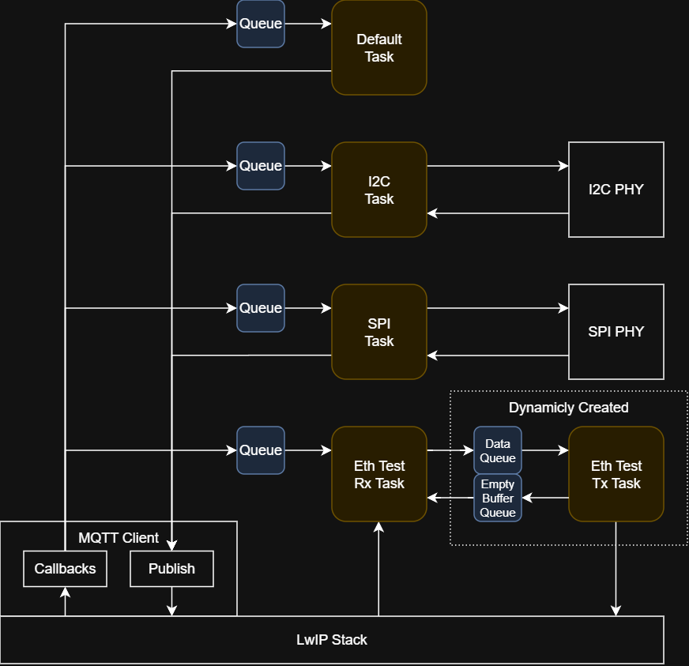
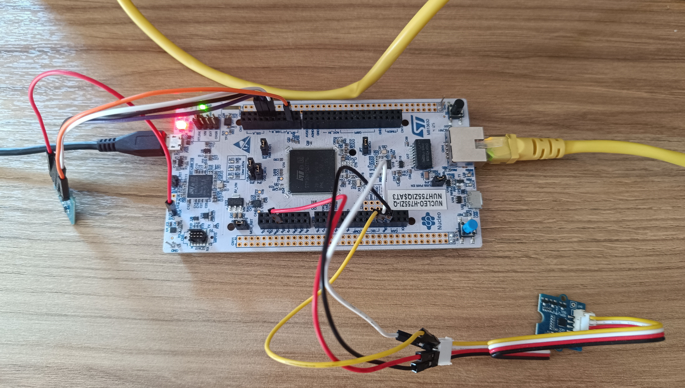

# FreeRTOS_LwIP_MQTT
<!-- what is this project, why it exists and what it contains -->
MQTT client built on top of LwIP & FreeRTOS. The LwIP MQTT API is not thread-safe and delivers received messages through callbacks executing in the TCP/IP context. This client converts the callback-based interface into a queue-based message-passing model suitable for RTOS applications. To demonstrate its use, such an application is provided. It features sensor drivers, logging, and Ethernet throughput tests. Implemented on STM32H755ZI.

## Project Architecture
<!-- MQTT client model, intro to the app & what it contains -->
The client is designed with a multi-task architecture in mind, in which it pushes incoming messages to the appropriate tasks using OS queues. To demonstrate its use, such an application has been developed. It includes the Ethernet performance tests from the [LwIP-FreeRTOS-STM32H755ZI](https://github.com/Manwlis/LwIP-FreeRTOS-STM32H755ZI) project as well as the LIS3DHTR, PMODALS, internal temp sensor drivers and the Light Weight Logging (LWL) module from the [Sensor Playground](https://github.com/Manwlis/sensor_playground) project.

### Task & Queue Layout
<!-- Schematic, rtos tasks, job separation -->
The application follows a conservative design, where each peripheral interface has its own task. This way, if there is a problem with an interface, the rest of the app will be unaffected. Furthermore, there is one more task focused on the app's & MCU's internals. All communication between the tasks and callbacks is facilitated through RTOS queues. A generalized view can be seen in the following diagram.



*High-level architecture view showing task ownership, queue routing, and MQTT client interaction with the LwIP stack.*

<!-- Detailed view of each task, topics & functionality  -->
In more detail, each task has the following functionality:
#### Default Task
Subscribed to _mod/lwl_ and _sensor/temp_ topics, using a single queue. Initializes the LwIP & MQTT stack and client. Reads the internal temperature sensor and dumps the lwl contents through MQTT. As both of these operations are non-blocking and not time critical, it is convenient to group them in the same task.

#### I2C Task
Subscribed to _sensor/lis3_ topic. Uses the high-level API of the LIS3DHTR driver in FreeRTOS-aware mode. The task yields while communication with the device is facilitated. No changes to the driver were required.

#### SPI Task
Subscribed to _sensor/als_ topic. Uses the high-level API of the PMODALS driver in FreeRTOS-aware mode. The task yields while communication with the device is facilitated. No changes to the driver were required.

#### Ethernet Test Task
Subscribed to _lwip/eth_test_ topic. Runs the selected Ethernet performance test until given a command to stop. In case of the multi-task test, an additional task will be spawned along with the required queues.

## MQTT Client API
<!-- API -->
The API consists of the following functions and macros:
- `mqtt_init()`: Initializes the module, OS infrastructure and connects to the MQTT broker.
- `mqtt_get_connection_status()`: Returns true if the client is connected to the broker, false if it is not.
- `mqtt_sub_topic()`: Subscribe to an MQTT topic. User must supply an OS queue to receive the MQTT messages. Returns a topic ID.
- `mqtt_unsub_topic()`: Unsubscribe from an MQTT topic.
- `mqtt_publish_wrapper()`: Wrapper of LwIP's `mqtt_publish()` function. Does error checking and handles TCPIP core locking.
- `mqtt_free_message()`: Return a received message back to the MQTT client.
- `compare_mqtt_payload()`: Helper function to compare a message with a given string. Can be set to complete match, or just the start of the payload.

<!-- data structures -->
Received messages are pushed to the appropriate task queue using the following structure:
```c
typedef struct _mqtt_os_message_t
{
	uint8_t data[MQTT_PAYLOAD_MAX_SIZE];    // The payload
	uint32_t len;                           // Size of the payload
	sub_topic_id_t topic_id;                // ID of the topic that received the payload
}mqtt_os_message_t;
```

<!-- Example Usage -->
### Example Usage
The following code block exhibits the usage of the API, excluding error checking. 
```c
    ...
	mqtt_init();

     // the task subscribes to two topics using the same queue
	sub_topic_id_t topic_A_id;
	sub_topic_id_t topic_B_id;
	osMessageQueueId_t mqtt_queue = osMessageQueueNew( NUM_MAX_ELEMENTS , sizeof(mqtt_os_message_t*) , NULL );
    mqtt_sub_topic( TOPIC_A , mqtt_queue , &topic_A_id );
    mqtt_sub_topic( TOPIC_B , mqtt_queue , &topic_B_id );

    while(1)
    {
       // wait for a message
		mqtt_os_message_t* message = NULL;
		osStatus_t status = osMessageQueueGet( mqtt_queue , &message , NULL , osWaitForever ); 

        if( message->topic_id == topic_A_id )
        {
            // Do topic A stuff
            mqtt_publish_wrapper( PUBLISH_TOPIC , data , sizeof( data ) , 0 , 0 , NULL , NULL );
        }
        else if( message->topic_id == topic_B_id )
        {
            // Do topic B stuff
            mqtt_publish_wrapper( PUBLISH_TOPIC , data , sizeof( data ) , 0 , 0 , NULL , NULL );
        }

		// free message
		mqtt_free_message( message );
    }
```

## Implementation Details
The client is built on top of the MQTT API provided by the LwIP stack and communicates with the rest of the codebase using CMSIS-RTOS2 queues. It has a static memory footprint of a few kilobytes, depending on the selected maximum sizes for the topic names, payloads etc.

<!-- LwIP -->
### LwIP configuration
The LwIP setup has been inherited by the [LwIP-FreeRTOS-STM32H755ZI](https://github.com/Manwlis/LwIP-FreeRTOS-STM32H755ZI) project. This includes LwIP parameter configuration, DMA & MPU set-up etc. There are two substantial changes:

* Increasing the number of simultaneously active timeouts, as by default LwIP calculates it only based on its active internal modules, not applications built on top of it.
```c
#define MEMP_NUM_SYS_TIMEOUT   (LWIP_NUM_SYS_TIMEOUT_INTERNAL + 1)
```
* Enabling TCPIP core locking. The MQTT API provided by the LwIP stack uses the RAW API, which requires core locking to be used from non-TCPIP task context.
```c
#define LWIP_TCPIP_CORE_LOCKING 1
```
<!-- Internal Structure. Do I need to show this? Having it here makes explaining the rest far easier. -->
### Internal Structure
All information required by the client, is organized with the following structures:
```c
typedef struct _mqtt_sub_topic_t
{
	char name[MQTT_TOPIC_NAME_MAX_SIZE];    // Name of the topic
	osMessageQueueId_t os_queue_id;         // Queue of the topic
	bool valid;                             // Valid flag
}mqtt_sub_topic_t;

typedef struct _mqtt_data_t
{
	mqtt_sub_topic_t sub_topics[MQTT_MAX_SUBBED_TOPICS];    // Array of subscribed topics 
	osMemoryPoolId_t os_memory_pool;    // Memory pool of the incoming messages
	mqtt_client_t* client;              // LwIP's MQTT API data structure 
	uint8_t num_topics;                 // Number of subscribed topics 
	bool connected;                     // Connected to broker flag
}mqtt_data_t;
```
This information is internal to the module, and is not accessible by the main application. The only variable that can be directly requested is the `connected` flag, through the `mqtt_get_connection_status()` API call.

<!-- Initialization -->
### Initialization
Function `mqtt_init()` has three responsibilities:
- Allocate and initialize the data-structures shown above.
- Set up the LwIP MQTT stack.
- Connect to the MQTT broker.

The function can be called at any time to reset the module.

<!-- Dynamic subscription -->
<!-- Task can sub to multiple topics using the same queue -->
### Subscribing to a Topic
Tasks can dynamically subscribe to topics using the `mqtt_sub_topic()` function, as long as the client is connected and there is free space in the array of subscribed topics. They must supply the handle of the queue that the received messages will be pushed on. A task can use the same queue for multiple topics.

<!-- Callback structure -->
### MQTT Callbacks
The MQTT messages are transferred from the LwIP MQTT stack to the client through the callbacks `mqtt_incoming_publish_cb()` & `mqtt_incoming_data_cb()`. The first one identifies which topic the message comes from, while the second callback puts the message to the appropriate queue. To achieve that, it allocates space from the MQTT memory pool. The receiving task is expected to free it after no longer needing the message.

## Application-specific integrations
The following modules required changes to be integrated to the project.

### LWL
<!-- data can be dumped through mqtt -->
To integrate the lwl module with MQTT, an additional functionality has been implemented. Upon command, it can dump all its contents through MQTT. If script `mqtt/sub.py` is listening, it will save them in files `code/debug/lwl/dump.bin` & `code/debug/lwl/info.txt`. Then, the script `scripts/lwl_decoder.py` can be used to decode the logs, as described in [Sensor Playground](https://github.com/Manwlis/sensor_playground) repo. Thus the whole logging-extracting-decoding chain has been automated and can be easily used to debug and monitor the application.


### Ethernet Tests
<!-- start stop on demand -->
<!-- dynamically create/destroy FreeRTOS & lwip resources -->
The socket API version of the performance tests has been integrated in the application. The tests have been slightly expanded to check for a stop command every 1000 data-packets transferred. All resources required by them, sockets, queues and tasks, are dynamically allocated. Extensive testing has been done to ensure that resources are properly deallocated and no resource leakage exists.

## Known Issues
<!-- delay to fix waking up after a long idle period problem -->
Data loss has been observed when transmitting large LWL dumps after a long idle period. The LwIP MQTT stack groups 10 MQTT messages into 3 TCP packets, but only the second packet is transmitted. Without the preceding idle period, all packets are successfully transmitted. Furthermore, socket-based connections do not exhibit this issue.

`lwip_stats` reports zero errors. Enabling LwIP debugging introduces significant delays, causing the 10 MQTT messages to be transmitted as 10 separate TCP packets, which eliminates the data loss. This makes identifying the root cause particularly difficult.

As a workaround, a 1 ms delay is inserted between consecutive MQTT publishes.

## How to Run
To run the example application:
1. On the host PC, change the IPv4 address of the adapter connected to the board to 192.168.0.1 and its subnet mask to 255.255.255.0.
2. Run mosquitto with the configuration file `mqtt/mosquitto.conf`.
3. To observe the MQTT traffic, run `mosquitto_sub -h 192.168.0.1 -p 1883 -t "#" -v` or the `mqtt/sub.py` script.
4. Program the device.
5. Control the firmware with `mosquitto_pub.exe -h 192.168.0.1 -p 1883 -t {topic} -m {payload}`.

### Available commands
| Topic         | Payload          | Notes |
| ------------- | ---------------- | --- |
| mod/lwl       | dump             | Replies in topics "mod/lwl/meta" & "mod/lwl/data" |
| sensor/lis3   | enable aux dacs  | |
| sensor/lis3   | disable aux dacs | |
| sensor/lis3   | enable temp      | |
| sensor/lis3   | disable temp     | |
| sensor/lis3   | enable bdu       | |
| sensor/lis3   | disable bdu      | |
| sensor/lis3   | set odr {value}  | Accepted values: 0 - 9 |
| sensor/lis3   | set res {value}  | Accepted values: 0 - 2 |
| sensor/lis3   | get temp         | Replies on topic "sensor/lis3/temp" |
| sensor/lis3   | get accel        | Replies on topic "sensor/lis3/accel" |
| sensor/als    | get lux          | Replies on topic "sensor/als/lux" |
| sensor/temp   | int              | Replies on topic "sensor/temp/int" |
| sensor/temp   | reduced          | Replies on topic "sensor/temp/int". Calculation minimizes divide operations. |
| sensor/temp   | float            | Replies on topic "sensor/temp/float" |
| lwip/eth_test | tcp simple       | Requires the script `scripts/server.py` to be running on host. |
| lwip/eth_test | tcp multi        | Requires the script `scripts/server.py` to be running on host. |
| lwip/eth_test | udp              | |

## Repo Structure
```
code/
├── CM7/    # MQTT application
├── CM4/    # Secondary core default application
mqtt/       # MQTT broker configuration & firmware control script
scripts/    # Non-MQTT scripts required by the project
docs/
server.py  # TCP loopback server
```

## Tools Used
* STM32CubeMX 6.17.0
* STM32Cube FW_H7 V1.13.0
* STM32CubeIDE 2.1.1
* FreeRTOS 10.6.2
* CMSIS-RTOS 2.1.3
* LwIP 2.2.1
* mosquitto 2.1.2




*The board*